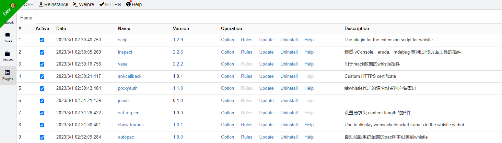
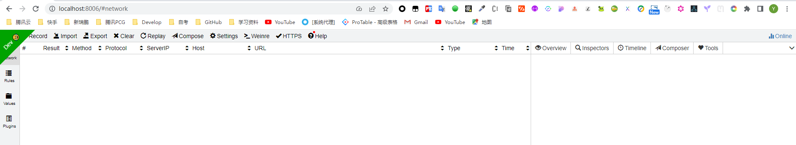

# Docker版Whistle，不依赖宿主机nodejs版本

# 运行指令

1. 离线Dockerfile部署
```bash
docker build -t  kamalyes/whistle:v1.0.1 .
docker run --name whistle -p 8900:8900 -d kamalyes/whistle:v1.0.1
docker exec -it whistle sh whistle-init.sh # 安装插件并初始化8899端口
```

2. dockerHub仓库
```bash
docker-compose -f ./test/docker-compose.yml up -d
docker exec -it whistle sh whistle-init.sh # 安装插件并初始化8899端口
```

# 效果



# 启动多个whistle
如果你想在同一台机器启动多个`whistle`，方便多个浏览器或者供多人使用，有两种方式：

切换到不同的系统用户，在每个系统用户启动一个`whistle`代理服务(每个服务的端口号可以用命令行参数`w2 start -p xxxx`来指定)
也可以通过切换规则目录和端口号的方式来解决(注意`S、C`都是大写, `newStorageDir`为空表示使用当前配置)
```bash
w2 start -S newStorageDir -p newPort
```
系统默认目录的配置拷贝到新的目录
```bash
w2 start -S newStorageDir -C -p newPort
```
也可以指定要拷贝的目录
```bash
w2 start -S newStorageDir -C storageDir -p newPort
```

Note: 这种拷贝是覆盖式的，会替换目标目录里面原有文件，启动时设置了新的存储目录，关闭或重启时也要把目录参数带上(端口号不要带上)：
```bash
w2 stop -S newStorageDir或w2 restart -S newStorageDir
```

比如分别在8899，8888，7788端口上开启3个实例：

默认端口8899，系统默认存储目录
```bash
w2 start
```
端口号为8888，存储目录为8888，并把系统默认目录的配置copy到8888目录

```bash
w2 start -S 8888 -C
```

端口号为7788，存储目录为7788，并把8888目录的配置copy到7788目录
```bash
w2 start -S 7788 -C 8888
```
Note: 不同实例要配置不同的代理


# 注意事项
```
1. 若暴漏的端口与宿主机不一致时，许使用宿主机端口
2. 若想安装插件需在初始化时使用`docker exec -it whistle sh whistle-init.sh`，否则需重启所有端口很麻烦
3. 复制任务需使用命令`docker exec -it whistle `
```

# 案例
```bash
E:\WorkSpaces\NodeProjects\docker-whistle>docker build -t  kamalyes/whistle:v1.0.1 .
[+] Building 33.9s (10/10) FINISHED
 => [internal] load build definition from Dockerfile                                                                                                            0.0s      
.....
 => => writing image sha256:47e85adfc52c298e5072e41a229d8d4880646b77ae7a66add325261a50e938f2                                                                    0.0s      
 => => naming to docker.io/kamalyes/whistle:v1.0.1                                                                                                              0.0s      

Use 'docker scan' to run Snyk tests against images to find vulnerabilities and learn how to fix them

E:\WorkSpaces\NodeProjects\docker-whistle>docker run --name whistle -p 8900:8900 -d kamalyes/whistle:v1.0.1
2991aa8c3dbb904fd9dc0e0ef7707efe44a1d58626a4e859ead0959ae06106a4

E:\WorkSpaces\NodeProjects\docker-whistle>docker exec -it whistle sh whistle-init.sh
开始安装script插件...
added 75 packages, and audited 76 packages in 5s
9 packages are looking for funding
  run `npm fund` for details
found 0 vulnerabilities
script安装完成...
.....

开始安装autopac插件...
added 1 package, and audited 2 packages in 1s
found 0 vulnerabilities
autopac安装完成...

启动容器...
[i] whistle@2.9.42 started
[i] 1. use your device to visit the following URL list, gets the IP of the URL you can access:
       http://127.0.0.1:8899/
       http://172.17.0.2:8899/
       Note: If all the above URLs are unable to access, check the firewall settings
             For help see https://github.com/avwo/whistle
[i] 2. set the HTTP proxy on your device with the above IP & PORT(8899)
[i] 3. use Chrome to visit http://local.whistlejs.com/ to get started
容器启动成功...

更多命令调用，请访问whistle官方文档：http://wproxy.org/whistle/options.html
Welcome to Node.js v18.15.0.
Type ".help" for more information.
>
```